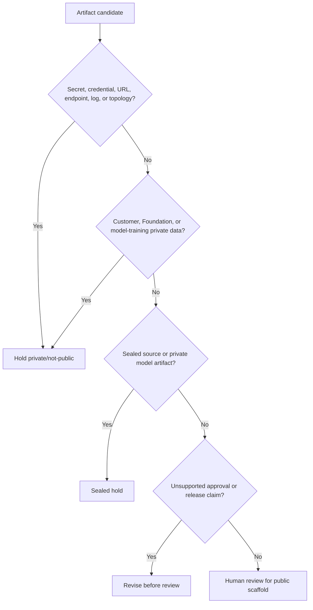

# Artifact Publication Decision Tree

Status: scaffolded

## Problem Statement

Public engineering proof needs a clear decision path for artifacts before any public repo creation, metadata change, publication, push, or route update.

## Synthetic Security / Boundary Context

This scaffold evaluates synthetic artifacts only. It does not evaluate live customer data, Foundation-private data, sealed source, production secrets, sensitive topology, endpoints, private logs, or private model artifacts.

## Public / Private / Sealed Definitions

| Boundary | Rule |
| --- | --- |
| Public | Safe only after human review and boundary checks |
| Private | Authorized operating group only |
| Sealed | Explicit human approval required before any excerpt leaves source |

## Secrets-Handling Rules

| Rule | Public-safe action | Held content |
| --- | --- | --- |
| No secret values | Use placeholders only | Secrets and credentials |
| No private links | Describe route class only | Private URLs and endpoints |
| No production context | Use synthetic system names | Production secrets and sensitive topology |
| No private records | Use invented review examples | Private logs |
| No hidden release step | Require human review | Metadata changes, pushes, or publication |

## Artifact Categories

- Documentation templates.
- Diagrams.
- Generated outputs.
- Screenshots.
- Logs.
- Model/data cards.
- Source excerpts.

## Repo Visibility Decision Points

1. Does the artifact contain secrets, credentials, private URLs, endpoints, private logs, or sensitive topology?
2. Does it contain customer data or Foundation-private data?
3. Does it contain private corpora, private weights, adapters, private training logs, private prompts, or private eval outputs?
4. Does it imply release, approval, compliance, or autonomous authority?

## Repo Visibility Rules

| Candidate condition | Default posture | Review action |
| --- | --- | --- |
| Synthetic documentation, no unsupported claim | Public candidate | Human review before public scaffold |
| Customer, Foundation, or client-owned material | private/not-public | Hold or remove |
| Sealed source or derivative risk | Sealed hold | Human authorization required |
| Secret, credential, URL, endpoint, topology, or log risk | private/not-public | Redact or remove |
| Release, approval, or metadata claim | Revision hold | Remove claim before review |

## Agent Permission Boundaries

| Agent action | Allowed in this scaffold? | Boundary |
| --- | --- | --- |
| Draft synthetic policy text | Yes | Human review required |
| Classify artifact boundary | Yes | Advisory only |
| Add remote, push, publish, or create repo | No | Separate human approval |
| Change GitHub or Hugging Face metadata | No | Separate human approval |
| Handle secrets or private data | No | Keep out |

## Data Boundary Categories

| Data category | Public-safe posture |
| --- | --- |
| Synthetic examples | Public candidate after review |
| Customer data | Held private/not-public |
| Foundation-private data | Held private/not-public |
| Donor, student, or volunteer data | Held private/not-public |
| Private corpora, private weights, adapters, training logs, private prompts, private eval outputs | Held private/not-public |
| Sealed source or private model artifacts | Sealed hold |

## Publication Hold Conditions

Any yes answer routes the artifact to `private/not-public`, sealed hold, or revision.

## Artifact-Publication Decision Tree

The decision tree below is the artifact routing rule for this scaffold. It does not authorize publication; it identifies the review path before any publication request.

## Mermaid Decision Tree

## Validation Questions

- Are secrets and credentials absent?
- Are private URLs and endpoints absent?
- Is customer data absent?
- Is Foundation-private data absent?
- Are private corpora, weights, adapters, prompts, and eval outputs absent?
- Are private model artifacts absent?
- Are agent actions limited to drafting and advisory classification?
- Does repo visibility remain planned until human approval?
- Is release or approval language held out?

## What This Proves

This proves a public-safe decision-tree structure for artifact publication review, including public/private/sealed definitions, secrets-handling rules, repo visibility rules, agent permission boundaries, data boundary categories, hold conditions, and human review gates.

## What This Does Not Prove

This does not prove security compliance, legal approval, client approval, model-release approval, dataset-release approval, autonomous agent authority, publication readiness, repo creation approval, push approval, or metadata approval.

## Public / Private / Sealed Checklist

| Boundary | Status |
| --- | --- |
| Synthetic examples only | scaffolded |
| Secrets absent | review |
| Credentials absent | review |
| Private URLs absent | review |
| Customer data absent | review |
| Foundation-private data absent | review |
| Sealed source absent | review |
| Private model artifacts absent | review |
| Private logs absent | review |
| Endpoints absent | review |
| Agent publication authority absent | review |
