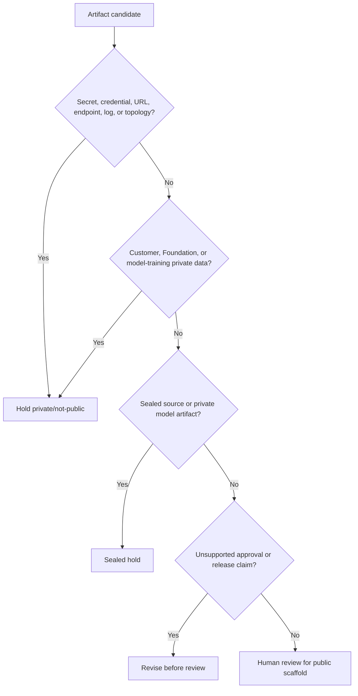

# Artifact Publication Decision Tree

Status: scaffolded

## Problem Statement

Public engineering proof needs a clear decision path for artifacts before any public repo creation, metadata change, publication, push, or route update.

## Synthetic Publication-Review Context

This scaffold evaluates synthetic artifacts only. It does not evaluate live customer data, Foundation-private data, sealed source, production secrets, or private model artifacts.

## Public / Private / Sealed Definitions

| Boundary | Rule |
| --- | --- |
| Public | Safe only after human review and boundary checks |
| Private | Authorized operating group only |
| Sealed | Explicit human approval required before any excerpt leaves source |

## Artifact Categories

- Documentation templates.
- Diagrams.
- Generated outputs.
- Screenshots.
- Logs.
- Model/data cards.
- Source excerpts.

## Repo Visibility Decision Points

1. Does the artifact contain secrets, credentials, private URLs, endpoints, private logs, or sensitive topology?
2. Does it contain customer data or Foundation-private data?
3. Does it contain private corpora, private weights, adapters, private training logs, private prompts, or private eval outputs?
4. Does it imply release, approval, compliance, or autonomous authority?

## Publication Hold Conditions

Any yes answer routes the artifact to `private/not-public`, sealed hold, or revision.

## Mermaid Decision Tree

## Validation Questions

- Are secrets and credentials absent?
- Are private URLs and endpoints absent?
- Is customer data absent?
- Is Foundation-private data absent?
- Are private model artifacts absent?
- Is release or approval language held out?

## What This Proves

This proves a public-safe decision-tree structure for artifact publication review.

## What This Does Not Prove

This does not prove security compliance, legal approval, client approval, model-release approval, dataset-release approval, autonomous agent authority, publication readiness, or metadata approval.

## Public / Private / Sealed Checklist

| Boundary | Status |
| --- | --- |
| Synthetic examples only | scaffolded |
| Secrets absent | review |
| Credentials absent | review |
| Private URLs absent | review |
| Customer data absent | review |
| Foundation-private data absent | review |
| Sealed source absent | review |
| Private model artifacts absent | review |
