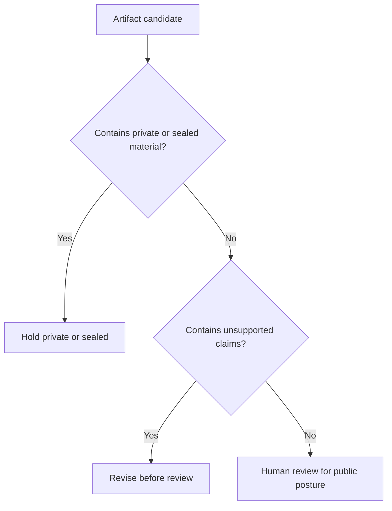

# Repo Visibility Decision Tree

Status: scaffolded

```mermaid
flowchart TD
  A["Artifact candidate"] --> B{"Contains private or sealed material?"}
  B -->|Yes| C["Hold private or sealed"]
  B -->|No| D{"Contains unsupported claims?"}
  D -->|Yes| E["Revise before review"]
  D -->|No| F["Human review for public posture"]
```

This decision tree does not approve publication.
